# SoundShare :headphones:

   

# 2020-1-Arquitectura de Software

## Descripción

SoundShare es una red social interactiva en la que podrás compartir tu música con tus amigos y con el mundo. Busca tus canciones favoritas de manera gratuita y agrégalas a tu playlist. 

Con SoundShare, puedes ser tu propio DJ, al crear o entrar a una de nuestras salas. Agrega las canciones que tú quieras, y compartelas, o si prefieres, descubre nuevo contenido dejando a tu amigo ser el DJ de esa sala.

## Integrantes y Roles

|     Nombre    |     Rol         |
|:--------------:|:-------------: |
|Sebastian Henao|Product Owner    |
|Luis A. Jaramillo|Team Developer |
|Carlos Castaneda|Team Developer  |
|Fernando Barrera|Team Developer  |

### Creado por ECIDevelopers 

   

## Enlaces 

+ [URL HEROKU](https://soundsharearsw.herokuapp.com/)

+ 

+ [Enlace a Taiga](https://tree.taiga.io/project/luisalejandrojaramillo-soundshare/backlog)

## Arquitectura

### Diagrama de clases

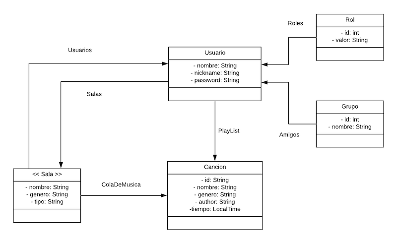

### Modelo Entidad relacion

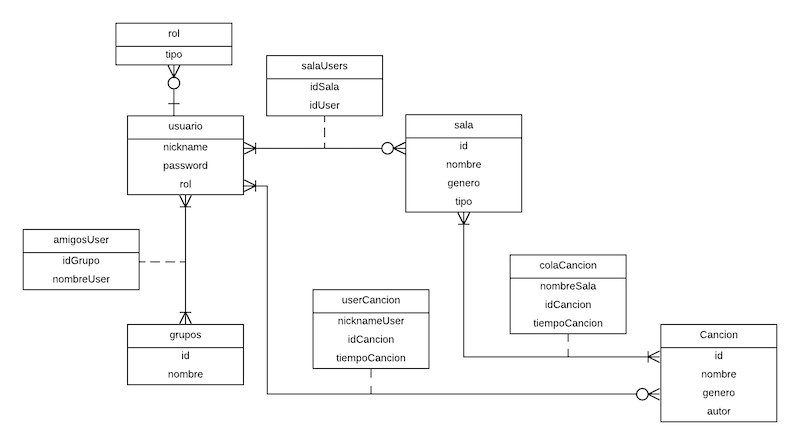

### Diagrama de despliegue

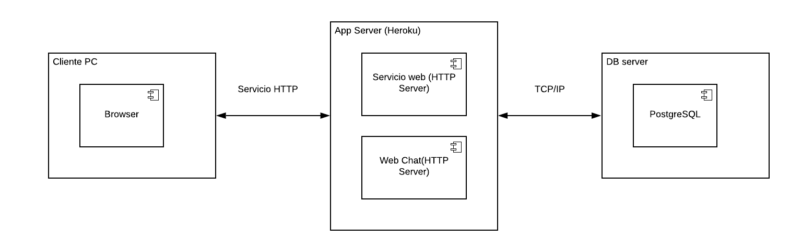

### Diagrama de casos de uso

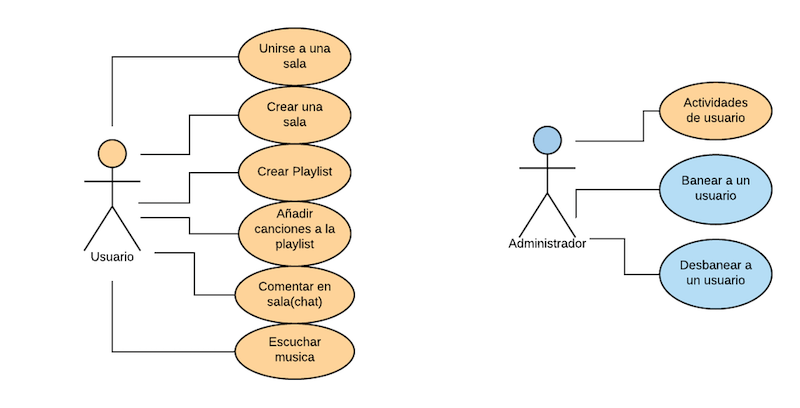

### Diagrama de Componentes

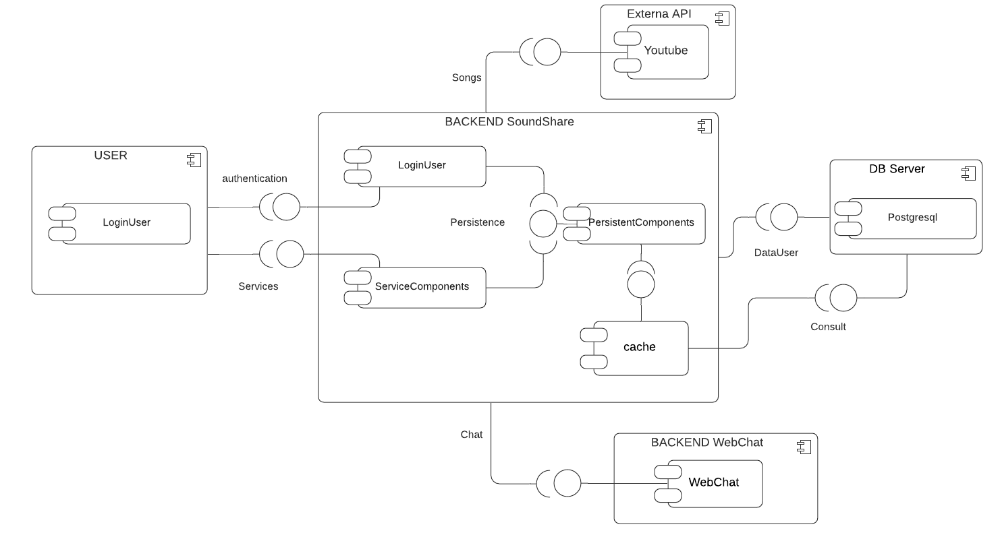

## Indicaciones Basicas

### Usuarios de ingreso

|     Id         |     Nombre     |     Nick       |     Password   |     Rol        |
|:--------------:|:--------------:|:-------------: |:--------------:|:-------------: |
|      36        | Fernando Barrera|     fer15     |      arsw1     |      admin     |
|      37        | Carlos Castañeda|     carlos2   |      arsw2     |      user      |
|      40        | Luis Jaramillo  |      luis3    |      arsw3     |      user      |

### Manual

#### Ingresar sesión

* Para ingresar a la aplicación, el usuario debe iniciar sesión, o si no esta registrado, debe crear una cuenta.

    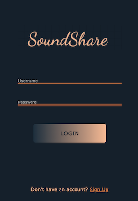 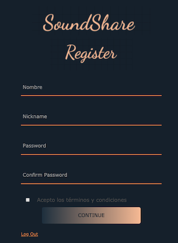

#### Perfil de usuario (General)

* En la parte super de la aplicación se encuentran las diferentes opciones que un usuario puede realizar desde su perfil.

   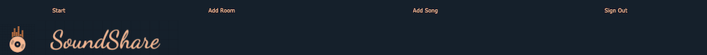
   
  * Add Room : Crea una sala con las opciones que él quiera.
    * Ingresa los detalles de tu sala.
    
    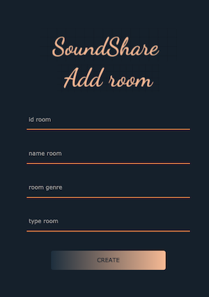
    
  * Add Song : Agrega una canción en la aplicación.
    * Ingresa los detalles de la nueva canción.
    
    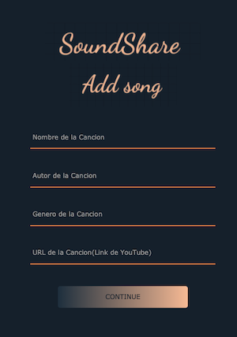
         
  * Sing Out : Salirse de la cuenta.
  
* En el cuerpo de la aplicación se encuentra ubicado las salas a las que se pude acceder y tu playlist.
  
  * Accede a la sala oprimiento el boton en forma de sillon.
  
    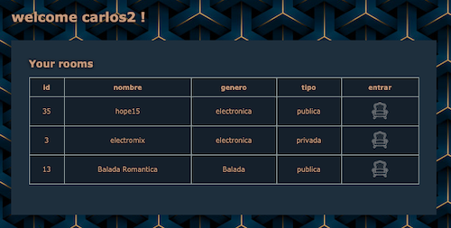
  
  * Oprime el boton de play para reproducir la canción que se encuentra en la playlist.
  
* En la parte inferior se encuentra el reproductor de música.
   
  
   
  * Allí podras colocar la canción que deseas escuchar.
  * Oprime el boton de busqueda (la lupa) para reproducir la canción.
  * botones de siguiente y atras, para cambiar a la siguiente canción o la anterior.
  
#### Perfil del Administrador

* En el cuerpo de la aplicación se encuentra ubicado las salas a las que se pude acceder, tu playlist y la opción de eliminar algun usuario.
  
  * Accede a la sala oprimiento el boton en forma de sillon.
  
    
  
  * Oprime el boton de la X para eliminar a un usuario.
  
    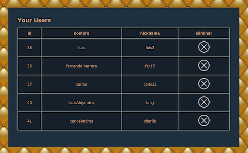
  
  * Oprime el boton de play para reproducir la canción que se encuentra en la playlist.

#### Sala

* En el cuerpo de la aplicación se encuentra la lista de canciones que se reproduciran en la sala y el chat con las personas que estan dentro de la sala.

  * Escribe tus comentarios dentro del chat y dale al boton de enviar para que los demas vean lo que escribiste.
  
    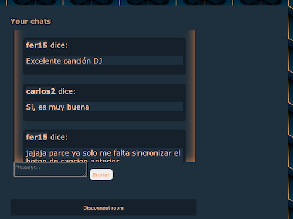

 
