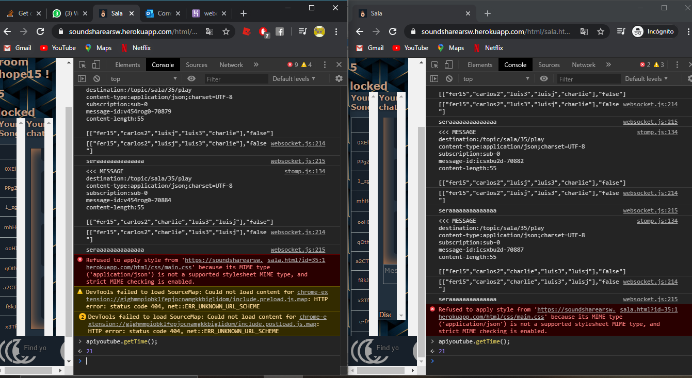
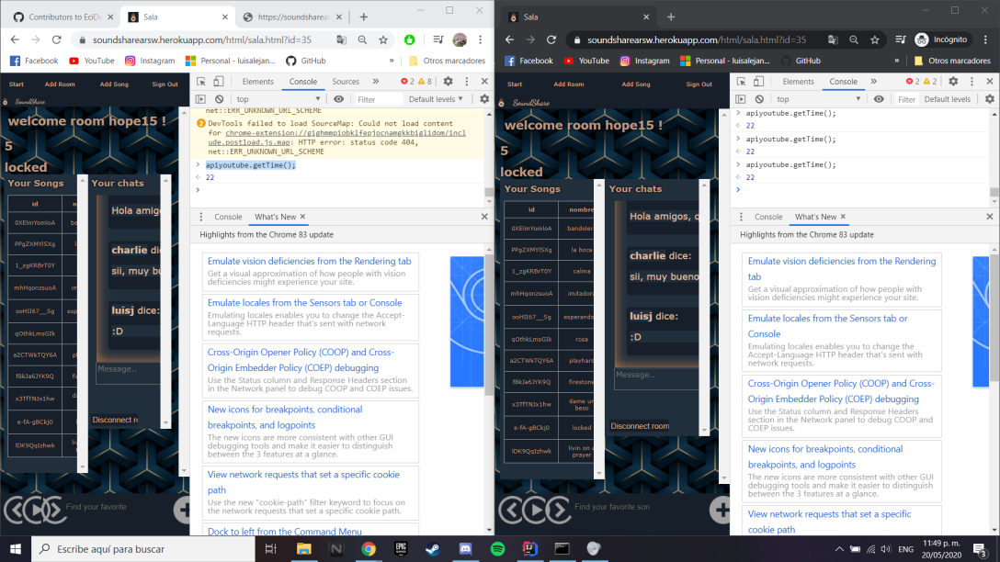
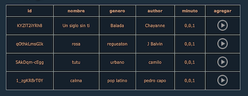
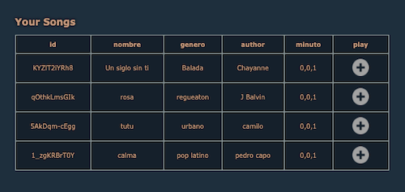

# SoundShare :headphones:

   

# 2020-1-Arquitectura de Software

## Descripción

SoundShare es una red social interactiva en la que podrás compartir tu música con tus amigos y con el mundo. Busca tus canciones favoritas de manera gratuita y agrégalas a tu playlist. 

Con SoundShare, puedes ser tu propio DJ, al crear o entrar a una de nuestras salas. Agrega las canciones que tú quieras, y compartelas, o si prefieres, descubre nuevo contenido dejando a tu amigo ser el DJ de esa sala.

## Integrantes y Roles

|     Nombre    |     Rol         |
|:--------------:|:-------------: |
|Sebastian Henao|Product Owner    |
|Luis A. Jaramillo|Team Developer |
|Carlos Castaneda|Team Developer  |
|Fernando Barrera|Team Developer  |


### Creado por ECIDevelopers 

   

## Enlaces 

+ [URL HEROKU](https://soundsharearsw.herokuapp.com/)

+ [](https://circleci.com/gh/EciDevelopers/SoundShare)

+ [Enlace a Taiga](https://tree.taiga.io/project/luisalejandrojaramillo-soundshare/backlog)

+ [](https://www.codacy.com/gh/EciDevelopers/SoundShare?utm_source=github.com&amp;utm_medium=referral&amp;utm_content=EciDevelopers/SoundShare&amp;utm_campaign=Badge_Grade)

## Arquitectura

### Diagrama de clases


### Modelo Entidad relacion


### Diagrama de despliegue


### Diagrama de casos de uso


### Diagrama de Componentes


## Atrubitos No funcionales

### Usabilidad
* Diseño estético y minimalista

    La aplicación web esta diseñada para que el usuario se guíe fácilmente sobre su entorno y pueda disfrutar de su contenido de la formas más agradable posible.El diseño de esta plataforma fue creada para que cualquier persona se sienta cómoda con su visualización. Para ello se crea una paleta de colores que representan el estilo de la aplicación.
    ```
    #EDBB99 curaba
    #C9804F curaba oscuro
    #212F3C azul claro
    #17202A azul oscuro
    ```
* Flexibilidad y eficiencia de uso

    Nuestro chat al diferenciar las salas y reconocer los usuarios conectados, logra ser más eficiente en la interacción de nuestra aplicación de tal modo que el usuario no se preocupe de registrase en el chat correspondiente a la sala, mejorando así su experiencia. 
    
    

### Rendimiento
* Aseguramos la correcta sincronizacion en el tiempo de las canciones en todas las salas, este puede tener 2 Segundos de diferencia.
    
    
    
    

## Indicaciones Basicas

### Usuarios de ingreso

|     Id         |     Nombre     |     Nick       |     Password   |     Rol        |
|:--------------:|:--------------:|:-------------: |:--------------:|:-------------: |
|      36        | Fernando Barrera|     fer15     |      arsw1     |      admin     |
|      37        | Carlos Castañeda|     carlos2   |      arsw2     |      user      |
|      40        | Luis Jaramillo  |      luis3    |      arsw3     |      user      |

### Manual

#### Ingresar sesión

* Para ingresar a la aplicación, el usuario debe iniciar sesión, o si no esta registrado, debe crear una cuenta.

     

#### Perfil de usuario (General)

* En la parte super de la aplicación se encuentran las diferentes opciones que un usuario puede realizar desde su perfil.

   
   
  * Add Room : Crea una sala con las opciones que él quiera.
    * Ingresa los detalles de tu sala.
    
    
    
  * Add Song : Agrega una canción en la aplicación.
    * Ingresa los detalles de la nueva canción.
    
    
         
  * Sing Out : Salirse de la cuenta.
  
* En el cuerpo de la aplicación se encuentra ubicado las salas a las que se pude acceder y tu playlist.
  
  * Accede a la sala oprimiento el boton en forma de sillon.
  
    
  
  * Oprime el boton de play para reproducir la canción que se encuentra en la playlist.
  
    
  
* En la parte inferior se encuentra el reproductor de música.
   
  
   
  * Allí podras colocar la canción que deseas escuchar.
  * Oprime el boton de busqueda (la lupa) para reproducir la canción.
  * botones de siguiente y atras, para cambiar a la siguiente canción o la anterior.
  
#### Perfil del Administrador

* En el cuerpo de la aplicación se encuentra ubicado las salas a las que se pude acceder, tu playlist y la opción de eliminar algun usuario.
  
  * Accede a la sala oprimiento el boton en forma de sillon.
  
    
  
  * Oprime el boton de la X para eliminar a un usuario.
  
    
  
  * Oprime el boton de play para reproducir la canción que se encuentra en la playlist.
  
    


#### Sala

* En el cuerpo de la aplicación se encuentra la lista de canciones que se reproduciran en la sala y el chat con las personas que estan dentro de la sala.

  * Escribe tus comentarios dentro del chat y dale al boton de enviar para que los demas vean lo que escribiste.
  
    
    
  * Encontraras las canciones que se encuentran en la cola de reproducción.
  * Oprime el boton del mas para agregar la canción dentro de tu playlist.
  
    
  
* En la parte inferior de la aplciación se encuentra la barra de reproudcción de la sala

  

  * Para agregar una canción dentro de la cola, primero debemos de escribir la canción en la barra y luego le daremos al boton del mas (si es la primera canción que se va a agregar debe darle a la lupa).
  
   


 
