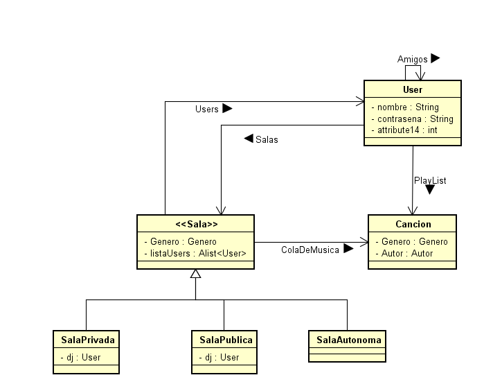
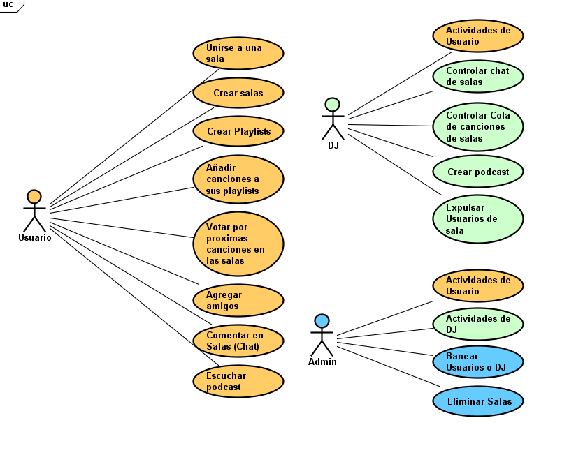
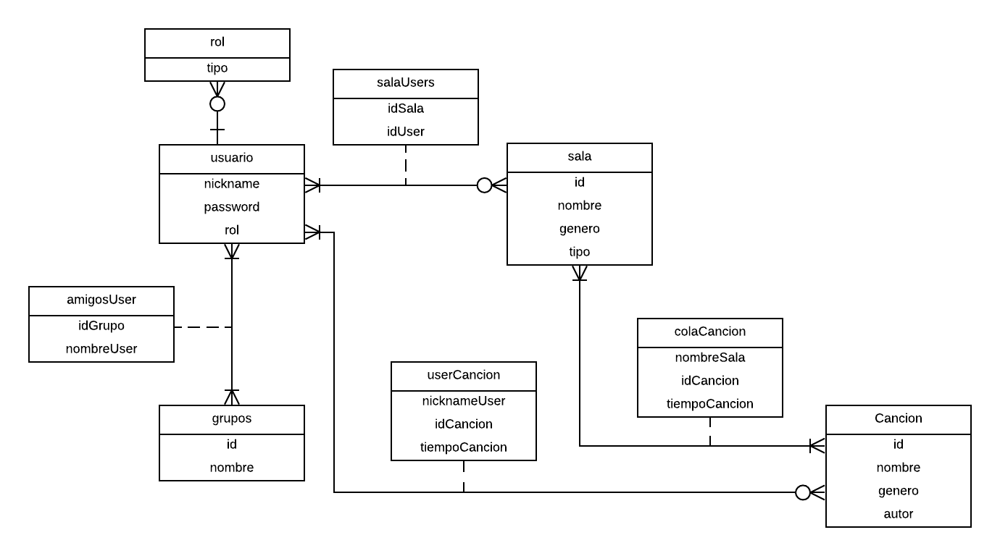

# SoundShare

# 2020-1-Arquitectura de Software

## Integrantes y Roles

|     Nombre    |     Rol         |
|:--------------:|:-------------: |
|Sebastian Henao|Product Owner    |
|Luis A. Jaramillo|Team Developer |
|Carlos Castaneda|Team Developer  |
|Fernando Barrera|Team Developer  |

### [URL HEROKU](https://soundsharearsw.herokuapp.com/) 

## Descripción del producto.

### Descripción 

Esta aplicación web es una red social la que nos permite compartir nuestros gustos musicales con nuestros amigos y con el mundo. Tendremos a nuestras disposición diferentes salas para cada uno de nuestros géneros favoritos, donde la interacción con los integrantes de la sala puede ser totalmente personalizada, como poder votar por nuestra canción preferida o si quieres dejar a alguien a cargo para que sea el dj de la sala. 

### Diagrama de clases

### Diagrama de casos de uso

### Modelo Entidad relacion 

