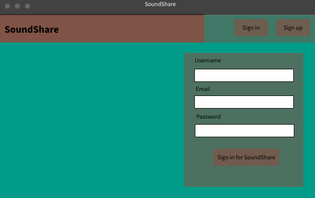
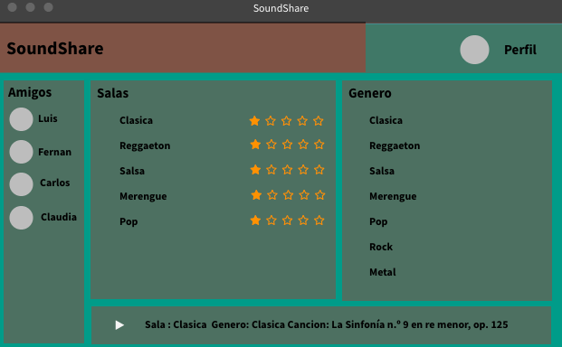
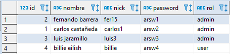

# SoundShare :headphones:

# 2020-1-Arquitectura de Software

## Descripción

Esta aplicación web es una red social la que nos permite compartir nuestros gustos musicales con nuestros amigos y con el mundo. Tendremos a nuestras disposición diferentes salas para cada uno de nuestros géneros favoritos, donde la interacción con los integrantes de la sala puede ser totalmente personalizada, como poder votar por nuestra canción preferida o si quieres dejar a alguien a cargo para que sea el dj de la sala.

## Integrantes y Roles

|     Nombre    |     Rol         |
|:--------------:|:-------------: |
|Sebastian Henao|Product Owner    |
|Luis A. Jaramillo|Team Developer |
|Carlos Castaneda|Team Developer  |
|Fernando Barrera|Team Developer  |

## Enlaces 

+ [URL HEROKU](https://soundsharearsw.herokuapp.com/)

+ 

+ [Enlace a Taiga](https://tree.taiga.io/project/luisalejandrojaramillo-soundshare/backlog)

## Arquitectura

### Diagrama de clases

### Modelo Entidad relacion

### Diagrama de despliegue

### Diagrama de casos de uso

### Diagrama de Componentes

### Diseño interfaz grafica

* Ingreso y creación de usuario.

* Interfaz principal de la aplicación web.

### Users

